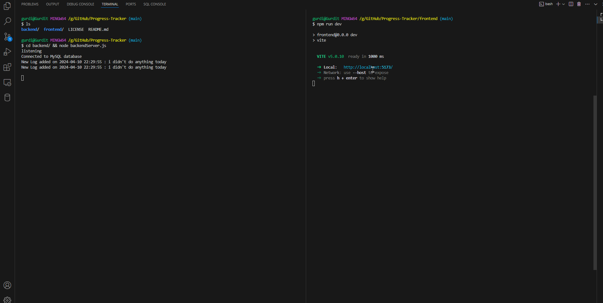

# Full-Stack Progress Tracker Application

The Full-Stack Progress Tracker Application is designed to empower users by allowing them to perform essential CRUD (Create, Read, Update, Delete) operations related to their daily progress. By seamlessly integrating with a database, this application provides a comprehensive solution for tracking and managing personal milestones.

## Project Goals:
The primary objectives of this project were:

### Skill Solidification:

- Strengthening proficiency in React, Node.js, and Express.
- Understanding the intricacies of full-stack development.
- Implementing best practices for code organization and maintainability.

### Database Integration:
  - Learning how to connect front-end components with a back-end database.
   - Handling data persistence and retrieval efficiently.
